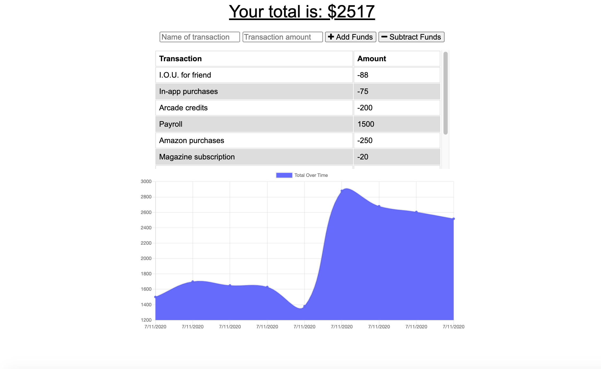

# Budget-Tracker-PWA

  

## Table of Contents

* [Link](#link)
* [Description](#description)
* [Design](#design)
* [Installation](#installation)
* [Usage](#usage)
* [Questions](#questions)

## Link

Access the application [here](https://still-savannah-20478.herokuapp.com/).

## Description

A budget tracker application, with functionality to work both online and offline.

## Design

The overall design uses the following:

* `MongooDB`, a document-oriented NoSQL database program
* `mongoose` for running MongoDB-based code
* `compression`, an NPM package used for compressing responses
* `node` for running application
* A manifest and service worker for online-offline functionality
* HTML, CSS, JavaScript and jQuery for website design

## Installation

To use this app in your environment:

1. Run the command `npm install` to install all the required dependencies.
1. Please make sure mongoDB is running.
1. Run the command `node server.js` to start the application.

## Usage

Using this app, you can submit financial transactions, whether you are online or offline. All of your transactions will show up on the graph below, so you can see in detail your spending and earning history even when on the go!

## Questions

For questions or collaborations, please contact me through [GitHub](https://github.com/vxmao87).